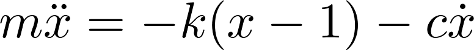

# sprung

Sprung is an easy-to-consume Curve that uses real physics equations to drive your animations.

## Easy to consume


```dart
AnimatedContainer(
  curve: Sprung(),
  /// ...
),
```

`Sprung()` also supports three damping curves, `Damped.under`, `Damped.critically`, and `Damped.over`. 

```dart
AnimatedContainer(
  curve: Sprung(
    damped: Damped.under
  ),
  /// ...
),
```

*Note: Sprung is critically damped by default.*

## Based on Physics

Using Newton's Second Law of Motion, Hooke's Law, and velocity based damping, we implement the following equation in three finite cases.



## Believable Motion


## Reliable

All curves are subjected to unit tests and gaurantee an epsilon of `5e-3`

## Credits

https://medium.com/@dtinth/spring-animation-in-css-2039de6e1a03
